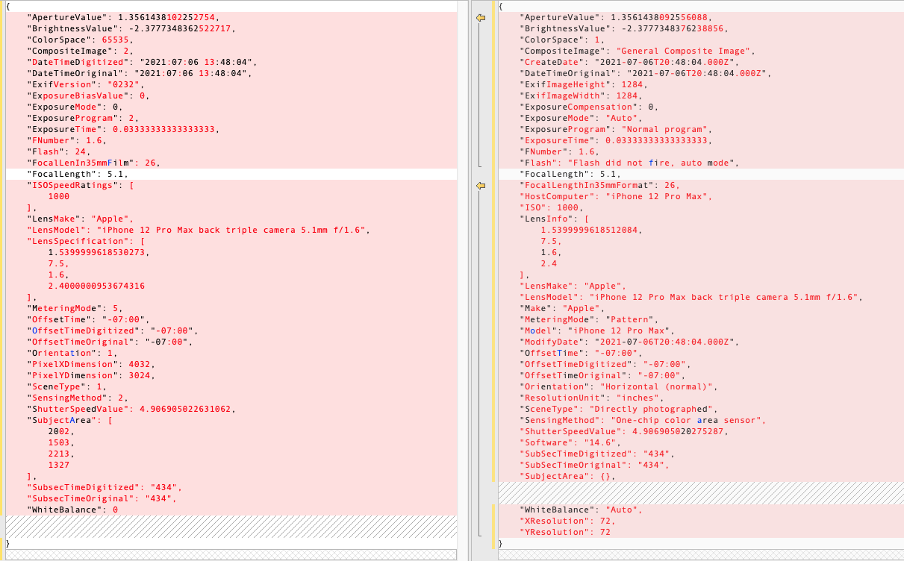

Exif Data Comparison 
Repository: https://github.com/dtarnawsky/capacitor-exif-test

The following code was used to compare exif data from the captured camera image vs exif data from the file that is saved.

```Typescript
toString(o: Object): string {
   return JSON.stringify(o, Object.keys(o).sort(), 4);
 }
 
 async takePicture() {
   console.log('take');
   const image = await Camera.getPhoto({
     quality: 90,
     allowEditing: true,
     resultType: CameraResultType.Uri
   });
   console.log('exif in image', this.toString(image.exif));
  
 
   fetch(image.webPath).then((resp) => resp.arrayBuffer()).then(async (ab) => {
     console.log(ab);
 
     const exif = await exifr.parse(ab, options);
     console.log('exif in file', this.toString(exif));     
   });
 }
```
## EXIF Comparison Android
Using Android 10 on a Note 9 device the fix was tested by capturing the image and saving the file. The JSON object for Exif data was compared. On the left is the Exif data from the camera and on the right is the exif data that was parsed from the saved file.


Each element in the exif data is present from camera and from the saved file (differences are in how the properties are interpreted.

## EXIF Comparison iOS
Using an iPhone 12 Max with iOS version 14.6 a comparison was done by capturing the image and saving the file. The JSON object for Exif data was compared. On the left is the Exif data from the camera and on the right is the exif data that was parsed from the saved file.



## Geolocation Information
On iOS and Android when obtaining images from the Camera EXIF information does not include location information. This is by design by the OS. Geolocation information can only be obtaining by accessing the Geolocation plugin.

Note: The iOS and Android Camera apps access Geolocation information and add location information into EXIF data of a photo stored in the Gallery/Photo Library. This means that if your application is able to select photos from the photo library then you are able to inspect the EXIF data and see location information.

### Getting Geolocation information
Your application will need to separately get geolocation information before or after capturing from the camera by calling `getCurrentPosition` (Example in [Capacitor 2](https://capacitorjs.com/docs/v2/apis/geolocation#example), [Capacitor 3](https://capacitorjs.com/docs/apis/geolocation#example)).

When using the Camera it is important that you do not set the option `saveToGallery` to true as any images saved to the gallery will not include geolocation information (remember the Camera plugin EXIF data doesn't include it).

Your application should then pass the photo and geolocation information to your backend API for processing (you could update the EXIF data on the backend to include this).

