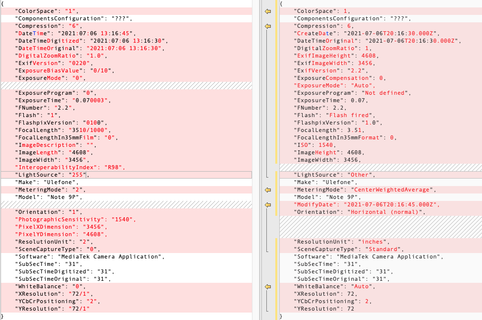

Exif Data Comparison 
Repository: https://github.com/dtarnawsky/capacitor-exif-test

The following code was used to compare exif data from the captured camera image vs exif data from the file that is saved.

```Typescript
toString(o: Object): string {
   return JSON.stringify(o, Object.keys(o).sort(), 4);
 }
 
 async takePicture() {
   console.log('take');
   const image = await Camera.getPhoto({
     quality: 90,
     allowEditing: true,
     resultType: CameraResultType.Uri
   });
   console.log('exif in image', this.toString(image.exif));
  
 
   fetch(image.webPath).then((resp) => resp.arrayBuffer()).then(async (ab) => {
     console.log(ab);
 
     const exif = await exifr.parse(ab, options);
     console.log('exif in file', this.toString(exif));     
   });
 }
```

Using Android 10 on a Note 9 device the fix was tested by capturing the image and saving the file. The JSON object for Exif data was compared. On the left is the Exif data from the camera and on the right is the exif data that was parsed from the saved file.



Each element in the exif data is present from camera and from the saved file (differences are in how the properties are interpreted.
